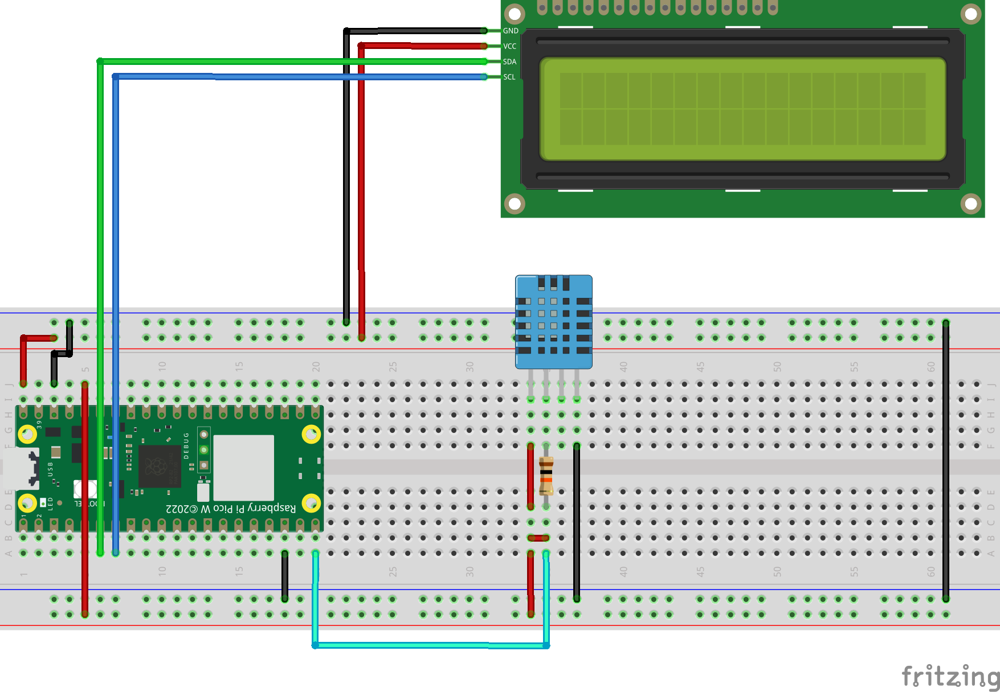

# Raspberry Pi Pico W - Telegram Example

### You can control your Pico from everywhere using telegram with this example

## Before use, You should upload all python files to Pico and you should change telegram_api_key with your API key in main.py

### Available commands:
* /ping: Returns PONG message as answer
* /led: It should take 2 parameters. First one is led index, second is led status. For example /led 1 1, turns on first LED. 
* /temp: Returns temperature value as answer
* /hum: Returns humdity value as answer
* /clear: clears LCD screen
* all of other messages shows in LCD screen

## For more details you can read <a href="#">this topic</a>

</img>